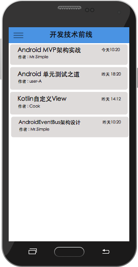
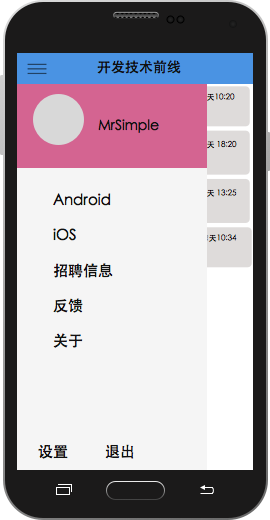

# 开发技术前线 Android 客户端需求文档

## 功能需求

1. 用户进入App，首先获取前50篇文章记录，显示文章标题、作者、阅读量、创建时间；
2. 下拉到最底部时加载后50条数据；
3. 用户点击某篇文章后跳转到文章阅读页面，通过webview加载相关内容；
4. 文章内容缓存到本地数据库;
5. 用户在主页可以通过左右滑动切换tab，含有Android、iOS、招聘信息、加入我们四个tab；
6. 用户可以通过第三方社交平台登录，可以分享文章到社交平台(微博、QQ、QQ空间、朋友圈、微信)；
7. 用户可以收藏文章，需要在菜单项中增加一个收藏菜单，用以切换到收藏的文章列表。

## 数据库设计

[数据库文档](document/db.md)

## 引用的库

* [picasso](https://github.com/square/picasso)

## 第三方SDK接入

* 新浪微博SDK;

## 服务端接口说明 

http://www.devtf.cn/articles.php?page=0&count=30&category=2

参数说明 :       
page : 用于数据分页( 加载更多 )，0代表第一页；     
count : 请求返回的数据量;     
category : 数据分类，2为android,3为iOS。    

## 未处理的问题

1. 文章的数据库存储;
2. 未添加列表头部的自动滚动广告条;如图
3. 第三方登录;
4. 分享到微博;
5. html页面只截取文章内容;
6. 招聘信息使用List的原生展示方式,服务器端需要添加数据库、API接口与管理页面;

## 界面版式图

|  |  |
|--------|--------|
| 主界面 | 菜单界面 |
