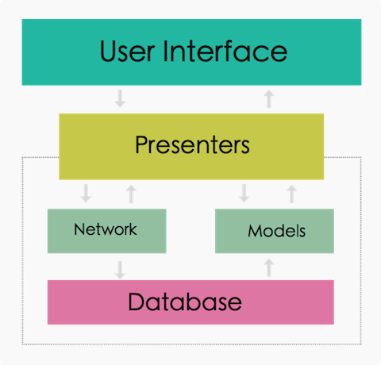

# 设计文档
----

## 一、整体设计

### 1.1 User Interface 

### 1.2 Presenters 

### 1.3 Network 

### 1.3 Models 

### 1.4 Database 

## 二、详细设计

### 泛型数据获取接口

public interface DataListener<T> {
	public void onStart();
	public void onComplete(List<T> result);
}

### 2.1 网络接口设计

* 获取最新的20篇文章     
void fetchArticles(int category, int page, DataListener<Article> listener);

参数说明 :    
category : 文章分类, android为2，iOS为3 ;    
page : 数据的页数,用于分页请求,即加载更多;         
listener : 数据回调对象,将结果回调给调用端;

### 2.2 数据库结构

数据库名 : `tech_frontier_app.db`;

**articles-表**

|   字段名  |   类型   |   备注    | 
|----------|----------|----------|
|   aid   |    int    |   主键，文章id |
|   author   |   varchar(30)  |   作者名 |
|   title   |   varchar(100)   |   文章标题 |
|   atype   |   int   |   文章分类,2为android,3为iOS |
|   save_time   |    date    |   这篇文章存储到数据库的时间 |

**favorites-文章收藏表**

|   字段名  |   类型   |   备注    | 
|----------|----------|----------|
|   id   |    int    |   主键，自增 |
|   aid   |    int    |   文章id |
|   uid   |    int    |   用户id |

**users-用户表**

|   字段名  |   类型   |   备注    | 
|----------|----------|----------|
|  uid   |    int    |   主键，用户id |
|   name   |   varchar(30)  |   用户名 |
|  avatar_url   |   varchar(200)   |   用户头像url |

### 2.3 数据库接口设计
* 存储文章
public void saveArticlesToDB(List<Article> articles);      
参数说明 :    
articles : 要存储的文章列表 ;  

* 从数据库加载缓存的文章       
loadArticlesFromDB(DataListener<Article> listener);     
参数说明 :             
listener : 数据回调对象,将结果回调给调用端;

* 收藏某篇文章,存储到数据库     
public void favorite(String uid, int articleId) ;     
参数说明 :    
uid : 用户id,用户登录之后保存;    
articleId : 文章的id;  

* 加载某用户收藏的所有文章     
public void loadFavorites(String uid) ;     
参数说明 :    
uid : 用户id,用户登录之后保存;    

* 删除过期文章       
public void removeArticle(int aid);       
参数说明 :    
aid : 文章的id;   

* 删除过期文章       
public void removeArticles();     
备注 : 数据库需要保存第一次存储这篇文章的时间,通过设置类来设置文章的过期时间 .

### 参考资料

[clean arch]()
